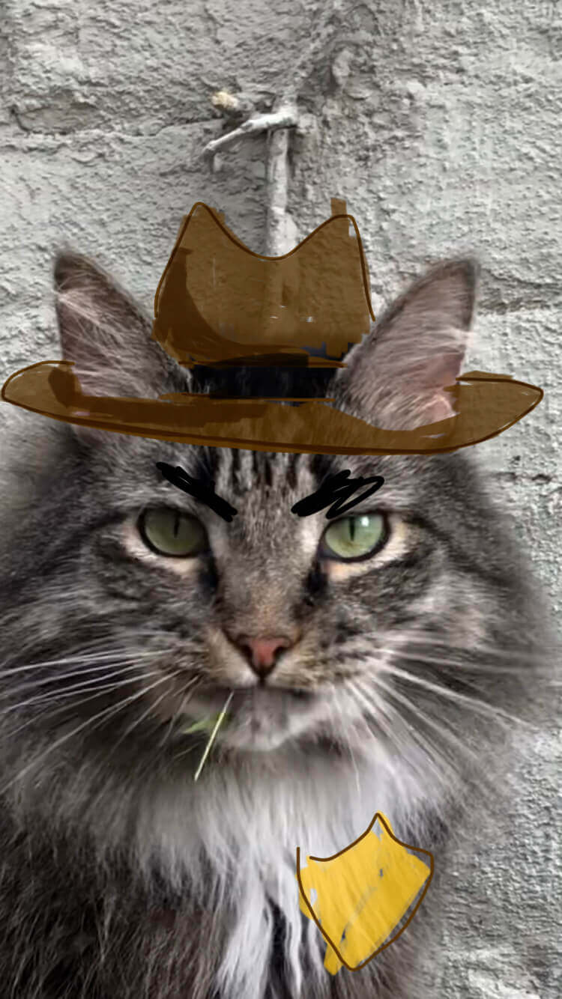

  

Howdy, partner.

# Welcome to [Griffin's Website](https://griffin-cat.netlify.app/)

## About

We love our pets and want everybody to know how special their little guy is. We teamed up to make a website about our cat. Griffin is the floofiest, bestest cat there is and so much so that we made a website dedicated to Griffin. This website will teach you everything there is to know about this kitty cat from the anatomy to his personality to even a pop quiz because we all love pop quizzes.

## Tech Stack

- Gatsby.js
- Netlify
- SASS

## [Gatsby's Silly Site Challenge](https://www.gatsbyjs.com/silly-site-challenge)

With everything going on in the world, Gatsby provided us an excuse to make a website about our cat. It was a lot of fun and we hope others will enjoy it as well.

### Criteria

- Creativity
- Accessibility
- Performance
- Silliness

## Future

- TODO

## Acknowledgements

- TODO
